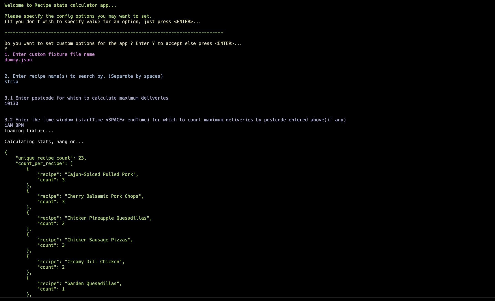

Recipe Stats Calculator
====

This a CLI based Go application that processes JSON file with recipe data and calculate some stats. Loads json data into memory and spin up Goroutines to process the data to calculate results/stats.


App Preview
---



Data Format
----
```json5
[
    {
      "postcode": "10224",
      "recipe": "Creamy Dill Chicken",
      "delivery": "Wednesday 1AM - 7PM"
    },
    {
      "postcode": "10208",
      "recipe": "Speedy Steak Fajitas",
      "delivery": "Thursday 7AM - 5PM"
    },
    {
      "postcode": "10120",
      "recipe": "Cherry Balsamic Pork Chops",
      "delivery": "Thursday 7AM - 9PM"
    },
    {
      "postcode": "10130",
      "recipe": "Cherry Balsamic Pork Chops",
      "delivery": "Saturday 1AM - 8PM"
    }
]
```

_Notes_
---
1. Property value `"delivery"` always has the following format: "{weekday} {h}AM - {h}PM", i.e. "Monday 9AM - 5PM"
2. The number of distinct postcodes is lower than `1M`, one postcode is not longer than `10` chars.
3. The number of distinct recipe names is lower than `2K`, one recipe name is not longer than `100` chars.

Functional Requirements
------

1. Count the number of unique recipe names.
2. Count the number of occurences for each unique recipe name (alphabetically ordered by recipe name).
3. Find the postcode with most delivered recipes.
4. Count the number of deliveries to postcode `10120` that lie within the delivery time between `10AM` and `3PM`, examples _(`12AM` denotes midnight)_:
    - `NO` - `9AM - 2PM`
    - `YES` - `10AM - 2PM`
5. List the recipe names (alphabetically ordered) that contain in their name one of the following words:
    - Potato
    - Veggie
    - Mushroom

Non-functional Requirements
--------

1. The application is dockerized.
2. Setup scripts are provided. We have done it using _Makefile_
3. The expected output is rendered to `stdout`. Additional info/errore are piped to `stderr`.
4. It is possible to:  
    a. provide a custom fixtures file as input  
    b. provide custom recipe names to search by (functional reqs. 5)  
    c. provide custom postcode and time window for search (functional reqs. 4)  


Expected output
---------------
The app generates a JSON file of the following format:

```json5
{
    "unique_recipe_count": 15,
    "count_per_recipe": [
        {
            "recipe": "Mediterranean Baked Veggies",
            "count": 1
        },
        {
            "recipe": "Speedy Steak Fajitas",
            "count": 1
        },
        {
            "recipe": "Tex-Mex Tilapia",
            "count": 3
        }
    ],
    "busiest_postcode": {
        "postcode": "10120",
        "delivery_count": 1000
    },
    "count_per_postcode_and_time": {
        "postcode": "10120",
        "from": "11AM",
        "to": "3PM",
        "delivery_count": 500
    },
    "match_by_name": [
        "Mediterranean Baked Veggies", "Speedy Steak Fajitas", "Tex-Mex Tilapia"
    ]
}
```
