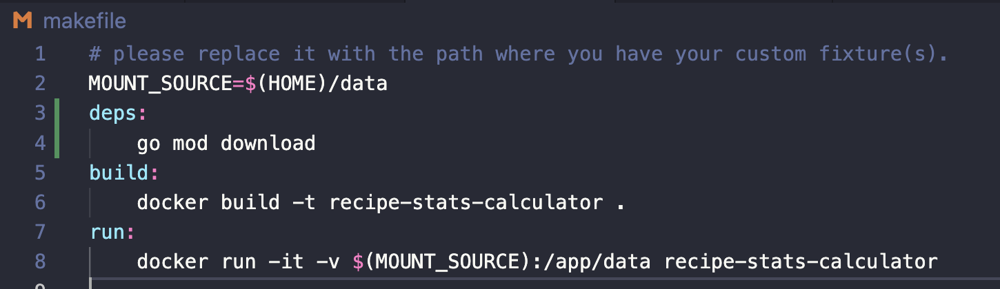
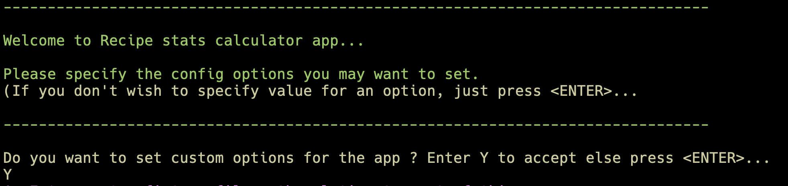
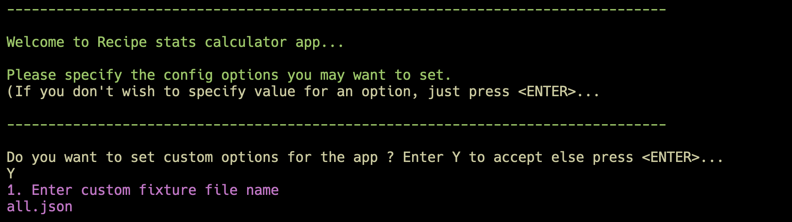
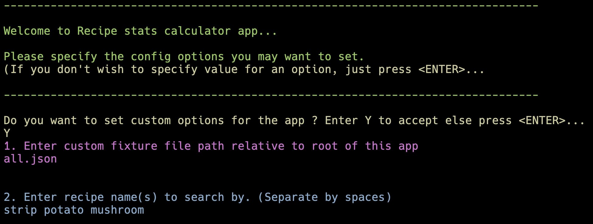
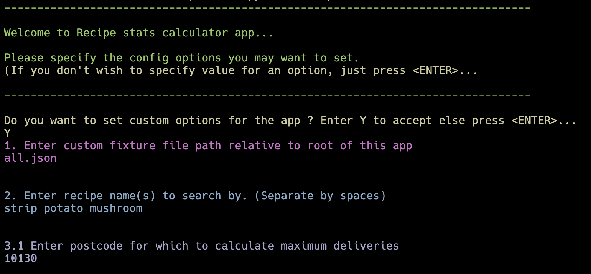
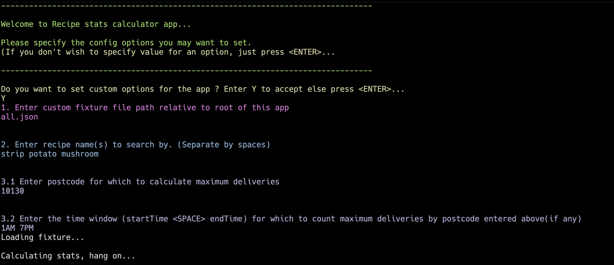

Recipe Stats Calculator
====
 As per non-functional requirements, this app is dockerized. And to load custom fixtures, requires volume mounting. There is a makefile in the root of this app folder, which would be used to setup and run this application. Please read below instructions...

Setup & Run Instructions(Run from repo)
-----
1. Clone this repository.
2. Open your terminal and cd into project root and then run:
    ```
    go mod download
    ```
This will download all required modules for this app.

3. Then to run the app, enter below command:
    ```
    go run main.go
    ```

Setup & Run Instructions(Run as docker container)  
-----
1. Clone this repository.
2. Open your terminal and cd into project root and then run below command:
    ```
    make build
    ```
This will create a docker image for the app on your local machine.

3. When image creation is successful, please run below command to run a container from the newly
    created docker image.
    ```
    make run
    ```


Notes
-----

1. There are two fixture files present in the `data` folder. `dummy.json` is lightweight and `all.json` is the fixture is original fixture file.
2. The dockerized app uses volumes to allow client to provide custom fixtures for the app. Please make sure that you put your custom fixture in the folder that you specify in the `MOUNT_SOURCE` var in the makefile as shown in below example. The `MOUNT_SOURCE` directory is mounted as a volume to the `data` directory inside the app container, from where it fetches and loads the fixtures specified.  



3. When using custom fixture option, you can only use fixture file names that are available in the `MOUNT_SOURCE` directory.
4. In case, client doesn't want to use custom fixture option, `all.json` will be used by default to calculate stats.

Step by step
------
The steps are pretty self explanatory. Below is a sample run of the containerized app.

1. After the introduction, the app asks if you want to provide custom options. If yes, enter `Y` and press <ENTER>


2. Enter the fixture name to be used for calculation. For docker container, specify any fixture name that is present in the `MOUNT_SOURCE` path specified in makefile. This is a mounted volume to `data` directory in the actual app in the container.  


3. Next, specify the list of recipe names(separated by `SPACE`)  


4. Next, enter the postcode  


5. Finally, enter the delivery time range filter and press <ENTER>, which will give some useful messages  


This will generate a JSON response like below:

```json5
{
    "unique_recipe_count": 29,
    "count_per_recipe": [
        {
            "recipe": "Cajun-Spiced Pulled Pork",
            "count": 667365
        },
        {
            "recipe": "Cheesy Chicken Enchilada Bake",
            "count": 333012
        },
        {
            "recipe": "Cherry Balsamic Pork Chops",
            "count": 333889
        },
        {
            "recipe": "Chicken Pineapple Quesadillas",
            "count": 331514
        },
        {
            "recipe": "Chicken Sausage Pizzas",
            "count": 333306
        },
        {
            "recipe": "Creamy Dill Chicken",
            "count": 333103
        },
        {
            "recipe": "Creamy Shrimp Tagliatelle",
            "count": 333395
        },
        {
            "recipe": "Crispy Cheddar Frico Cheeseburgers",
            "count": 333251
        },
        {
            "recipe": "Garden Quesadillas",
            "count": 333284
        },
        {
            "recipe": "Garlic Herb Butter Steak",
            "count": 333649
        },
        {
            "recipe": "Grilled Cheese and Veggie Jumble",
            "count": 333742
        },
        {
            "recipe": "Hearty Pork Chili",
            "count": 333355
        },
        {
            "recipe": "Honey Sesame Chicken",
            "count": 333748
        },
        {
            "recipe": "Hot Honey Barbecue Chicken Legs",
            "count": 334409
        },
        {
            "recipe": "Korean-Style Chicken Thighs",
            "count": 333069
        },
        {
            "recipe": "Meatloaf à La Mom",
            "count": 333570
        },
        {
            "recipe": "Mediterranean Baked Veggies",
            "count": 332939
        },
        {
            "recipe": "Melty Monterey Jack Burgers",
            "count": 333264
        },
        {
            "recipe": "Mole-Spiced Beef Tacos",
            "count": 332993
        },
        {
            "recipe": "One-Pan Orzo Italiano",
            "count": 333109
        },
        {
            "recipe": "Parmesan-Crusted Pork Tenderloin",
            "count": 333311
        },
        {
            "recipe": "Spanish One-Pan Chicken",
            "count": 333291
        },
        {
            "recipe": "Speedy Steak Fajitas",
            "count": 333578
        },
        {
            "recipe": "Spinach Artichoke Pasta Bake",
            "count": 333545
        },
        {
            "recipe": "Steakhouse-Style New York Strip",
            "count": 333473
        },
        {
            "recipe": "Stovetop Mac 'N' Cheese",
            "count": 333098
        },
        {
            "recipe": "Sweet Apple Pork Tenderloin",
            "count": 332595
        },
        {
            "recipe": "Tex-Mex Tilapia",
            "count": 333749
        },
        {
            "recipe": "Yellow Squash Flatbreads",
            "count": 333394
        }
    ],
    "busiest_postcode": {
        "postcode": "10140",
        "delivery_count": 22630
    },
    "count_per_postcode_and_time": {
        "postcode": "10130",
        "from": "1AM",
        "to": "7PM",
        "delivery_count": 3820
    },
    "match_by_name": [
        "Steakhouse-Style New York Strip"
    ]
}
```

To run unit tests
-----
Open your terminal and cd into project root and then run:
```
make test
```
  